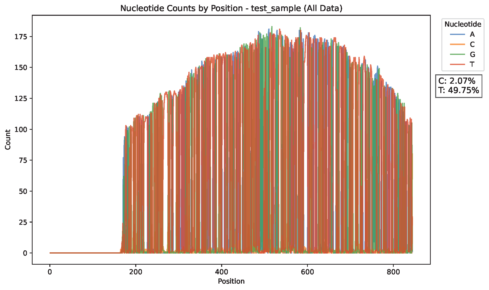
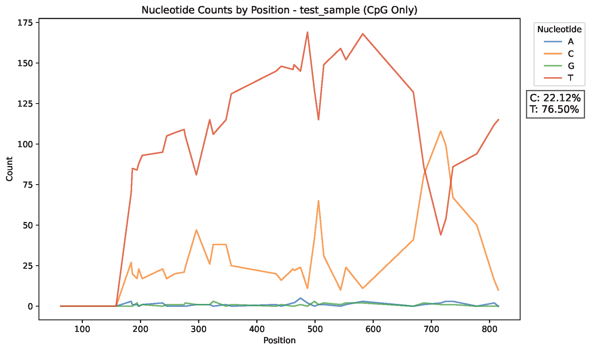

# methyl_aligner
======

methyl_aligner performs a global anchored alignment between a reference sequence (in
fasta format) and a collection of reads (in fastq format). It is designed to
align bisulfite-converted reads from an amplicon to a reference sequence.

## Installation ##

In order to run `methyl_aligner` you need to install EMBOSS and have `needle` in the
executable path. A convenient solution is to install via conda. First install
miniconda (or anaconda) and then type the following:

```
conda config --add channels defaults
conda config --add channels bioconda
conda config --add channels conda-forge
conda config --set channel_priority strict
conda create --name methyl_aligner_env emboss
conda activate methyl_aligner_env
conda install pandas
conda install seaborn
```

Global alignment is not computationally efficient: it is slow and uses a lot of
memory. For this reason, the reference sequence should be a fragment just large
enough to cover the amplion region.

## Usage ##

The `methyl_aligner` usage statement is reported if you don't give it the right
arguments.

```
usage: python3 methyl_aligner.py [options] <fasta> <fastq>
options:
  -h        show this help message and exit
  -p <int>  percent identity minimum [70]
  -t <int>  threads [4]
  -w <int>  wrap [50]
  -d <path> create and keep a named working directory for temp files
  -m        methyl mode
              uses an asymmetric scoring matrix with C:T matching
              computes percent identity from A/G only
  -f        force rewrite over named working directory
```
The `percent_mC.py` usage statement is reported if you don't give it the right
arguments.

```
usage: 
python3 percent_mC.py output.pdf --case file1.csv file2.csv --control file3.csv file4.csv
python3 percent_mC.py output.pdf --case file1.csv --control file2.csv -snp

option:
-snp		shows two predetermined snps
--case		groups your experimental csvs
--control	groups your control csvs
--color		colors each sample uniquely
```

Notes:

(1) By default, alignment is performed with a +1/-1 scoring matrix. in "methyl
mode", the scoring matrix gives +1 to C:T matches in one direction and -1 in
the other.

(2) Percent identity is calculated by ignoring gaps. In "methyl mode", percent
identity is calculated from only the As and Gs in the reference sequence.

(3) To examine the temporary files, use the `-d` option to keep the working
directory. This contains all of the intermediate FASTA files and pairwise
alignments.


## Example ##

```
python3 methyl_aligner.py -m -p 70 reference.fa test_sample.fq
```
## Example Output ##
```
results/
└── test_sample/
    ├── test_sample_matrix.csv
    ├── test_sample_matrix_ref_c.csv
    ├── test_sample_line_plot_all_data.pdf
    ├── test_sample_line_plot_cpg_only.pdf
    └── test_sample_reference.txt
```
## Example Visualizations

### All Data


### CpG Sites Only


### Smooth percent methylation

